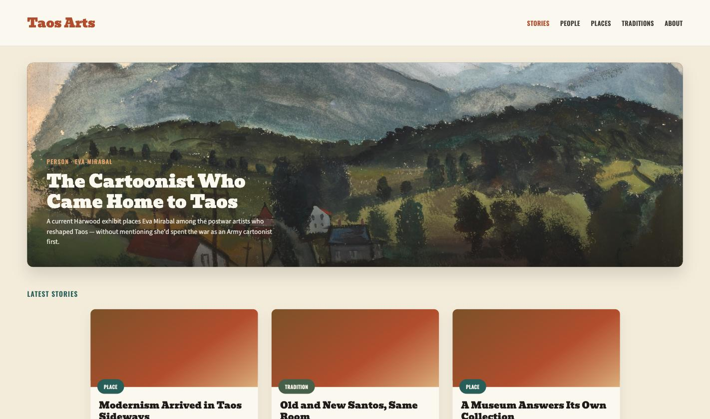

# taosarts.org — Taos Arts magazine

LAMP-stack PHP/MySQL magazine site for Taos, NM arts and culture:
editorial stories about artists, places, and traditions, an admin
panel for writing and publishing them, and a discovery-agent ingest
endpoint that feeds new story ideas into the same admin queue — built
for cheap shared hosting (GoDaddy-style cPanel), not a Node/serverless
stack. No framework, no build step, no Composer dependency — plain PHP
with PDO, deployable by copying files.

## What this does

- **Public pages** — `index.php` (home), `stories.php` (all stories),
  `story.php` (a single story), `people.php` / `places.php` /
  `traditions.php` (entity index pages by type), `entity.php` (a
  single person/place/tradition), `about.php`.
- **Admin panel** (`admin/`) — a story-ideas queue fed by the ingest
  API, a Markdown story editor (EasyMDE) with an inline image/link
  library, entity (person/place/tradition) CRUD, a central image
  library, and API token management for the ingest endpoint.
- **Ingest API** (`api/ingest.php`) — accepts bearer-token-authenticated
  `POST` requests carrying a story idea (spark, entities, suggested
  images/links, optional AI-drafted `draft_markdown`) from an external
  discovery agent, and inserts it into the admin's ideas queue for
  human review. Nothing it receives is ever auto-published — every
  story goes live only when someone publishes it from `admin/editor.php`.
- **Content-integrity rule at the render layer** — `includes/markdown.php`
  refuses to render an image that isn't immediately followed by an
  italic caption line, so a story can't ship an uncredited image no
  matter how it was written.
- **Local dev override** — `includes/config.php` loads an optional,
  gitignored `includes/config.local.php` (copy from
  `includes/config.local.example.php`) before falling back to
  `TAOSARTS_*` environment variables, so local MAMP-style settings
  never need to touch the production config path.

## Structure

- `index.php`, `stories.php`, `story.php`, `people.php`, `places.php`,
  `traditions.php`, `entity.php`, `about.php` — public site pages
- `admin/` — admin panel (ideas, stories, entities, images, tokens)
- `api/ingest.php` — the story-idea ingest endpoint
- `assets/` — shared CSS (`magazine.css` for the public site,
  `style.css` for the admin panel) and JavaScript
- `includes/` — config, database connection, auth, Markdown rendering,
  and shared helper functions
- `database/schema.sql` — schema and seed content
- `uploads/` — user-uploaded images (gitignored except a placeholder)

## Local setup

1. Create a MySQL database.
2. Import [`database/schema.sql`](database/schema.sql).
3. Either copy `includes/config.local.example.php` to
   `includes/config.local.php` (gitignored) for local MAMP-style
   settings, or set these environment variables directly:
   - `TAOSARTS_DB_HOST`, `TAOSARTS_DB_PORT` or `TAOSARTS_DB_SOCKET`,
     `TAOSARTS_DB_NAME`, `TAOSARTS_DB_USER`, `TAOSARTS_DB_PASS`,
     `TAOSARTS_BASE_URL`
4. Serve the project root as the web root so the homepage loads from `/`.

## Demo admin login

The schema seeds one admin account (`admin@taosarts.org`) with a
placeholder password. **Change it immediately after importing the
schema on any environment reachable from the internet** — see
"Changing the admin password" below.

## Deploying to GoDaddy cPanel

Either method needs the same one-time database setup and production
config file; they differ only in how files get from GitHub onto the
server.

1. In cPanel's **MySQL® Databases**, create a database and a user with
   a strong password, and add that user to the database with all
   privileges.
2. In **phpMyAdmin**, import `database/schema.sql` into that new
   database.
3. In **File Manager**, create `includes/config.local.php` inside the
   deployed copy (it's gitignored, so it never comes from Git or from
   the FTP deploy) with the real production values — copy the shape
   from `includes/config.local.example.php`, using the DB name/user/
   password from step 1 and `TAOSARTS_BASE_URL` set to
   `https://taosarts.org`.
4. Make sure `uploads/` is writable by the web server user.
5. Change the seeded admin password (below) before telling anyone the
   site is live.

### Option A: Git Version Control (manual deploys)

6. In cPanel, open **Git™ Version Control** → **Create**.
   - Clone URL: this repo's GitHub URL.
   - Repository Path: your domain's document root (e.g.
     `/home/<cpanel-user>/public_html`, or the addon domain's folder)
     — this repo is arranged so the project root *is* the web root,
     matching `.htaccess`'s existing block on dotfile paths
     (`.git`, `.gitignore`, etc.) and on `includes/`/`database/`.
   - Branch: `main`.
7. To ship a later update: push to `main` on GitHub, then in cPanel's
   Git Version Control, **Manage** the repo → **Update from Remote**,
   then **Deploy HEAD Commit**.

### Option B: GitHub Actions FTP deploy (automatic)

`.github/workflows/ftp-deploy.yml` pushes the repo to the server over
FTPS on every push to `main`, using
[SamKirkland/FTP-Deploy-Action](https://github.com/SamKirkland/FTP-Deploy-Action).
It never deletes anything it didn't itself upload, so it's safe to run
against a document root that already has `uploads/` or
`config.local.php` sitting in it.

6. In cPanel, open **FTP Accounts** and create (or reuse) an account
   scoped to the domain's document root.
7. In the GitHub repo's **Settings → Secrets and variables → Actions**,
   add:
   - `FTP_SERVER` — the FTP hostname for the account
   - `FTP_USERNAME` — the FTP account's login
   - `FTP_PASSWORD` — the FTP account's password
8. Push to `main`. The workflow deploys automatically; check the
   **Actions** tab for progress and logs.
9. If the account's FTP root isn't already the domain's document root,
   edit `server-dir` in the workflow file to match.

### Changing the admin password

Log in with the seeded account, then go to **My account** in the admin
sidebar (`admin/account.php`) and change the password there — it
verifies the current password before accepting a new one.

## Shared hosting notes

- Arranged so the domain root can point directly at the project root.
- `uploads/` and `includes/config.local.php` are gitignored.
- `includes/`, `database/`, and any dotfile path (including `.git`)
  are blocked in `.htaccess`; the HTTPS redirect there is skipped for
  `localhost`-style hosts during dev.

---
More projects at [enricolorenzo.com](https://enricolorenzo.com) · art at [enricotrujillo.com](https://enricotrujillo.com)
